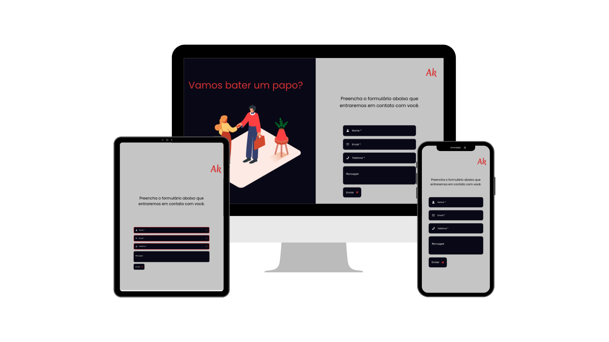

<h1 align="center">Formulário</h1>

<h3 align="center">
   
</h3>

<br>
A aplicação é a implementação de um formulário, que valida as informações preenchidas pelo usuário e as envia por o e-mail. 
<br><br>
Para a validação, foi utilizado a biblioteca <a href="https://github.com/jquense/yup"> YUP </a>, a qual é bem simples de se trabalhar e nos fornece diversos tipos de validação.
<br><br>
Para envio de emails, foi utilizado a biblioteca <a href="https://www.emailjs.com/"> EMAILJS </a> 

## :computer: Tecnologias 
This project was developed with:

* [ReactJS](https://pt-br.reactjs.org/)

## :gear: Como usar
Para utilizar a aplicação, basta clonar este repositorio e instalar as dependencias, como mostra o exemplo abaixo:

* FrontEnd

``` JavaScript
//Instalando Dependencias
yarn

//Rodando Aplicação
yarn start
```


  <h6 align= "right">
    <a href="https://www.linkedin.com/in/matheus-akio-santos-ishiguro-756394129/"> By Matheus Ishiguro :v: </a>
  </h6>

